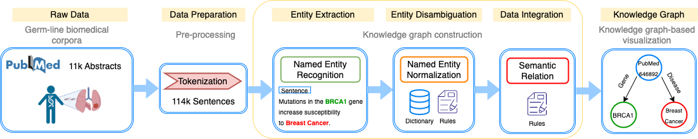

# Bio-Germline-Diseases-BERT-NER

## Workflow

## Dependencies

`Python 3.7`

## Setup

Install packages: `pip install  -r requirements.txt`

## Create Jupyter Notebook Kernel

`python -m ipykernel install --user --name=bio-germline-diseases-bert`

## Raw Data

Data can be found in the folder `data`.

Files:

+ `pubmed_abstracts`: CSV file contains Pubmed ID, and Abstract.
+ `gene_names`: CSV file contains list of genes and alternative gene names.
+ `gene_disease_assn`: CSV file contains list of genes, associated diseases, and alternative disease names.

## Run Pipeline

### Data Pre-processing

`nohup python pre-processing/tokenization.py &`

### Name Entity Recognition

`nohup python NER/ner_model.py &`

### Name Entity Disambiguation

`nohup python NER/ner_disambiguation.py &`

### Knowledge Graph

Execute jupyter notebook `knowledge-graph/create-graph`

You can also build the graph by running the cql query `knowledge-graph/crqCreateGraph.txt` in your Neo4j Browser.

### Charts

Execute jupyter notebook `charts/chart-wordcloud`

#### WordCloud Genes: Name Entity Recognition

#### WordCloud Genes: Name Entity Disambiguation

#### WordCloud Diseases: Name Entity Recognition

#### WordCloud Diseases: Name Entity Disambiguation

### General Statistics

Execute jupyter notebook `charts/stats`

## Results

Results can be found in the folder `results`.

Files:

+ `pubmed_sentences`: CSV file contains Pubmed ID, Sentence#, and Sentences from abstracts
+ `ner_genes`: CSV file contains Pubmed ID, Sentence#, Word (NER Gene), Start (Position), End (Position), Entity (Type)
+ `ner_diseases`: CSV file contains Pubmed ID, Sentence#, Word (NER Disease), Start (Position), End (Position), Entity (Type)
+ `ner_disambiguated_genes`: CSV file contains disambiguated entities for the `ner_genes` file
+ `ner_disambiguated_diseases`: CSV file contains disambiguated entities for the `ner_diseases` file
  
## Graphs

### Graph 1: Gene <- PubMedID -> Disease {name: 'Teeth (Benign)'}

### Graph 2: PubMedID -> Disease {name: 'Teeth (Benign)'}

### Graph 3: PubMedID -> Gene {name: 'AXIN2'}

### Graph 4: Gene <- PubMedID {name: '9024708'} -> Disease

